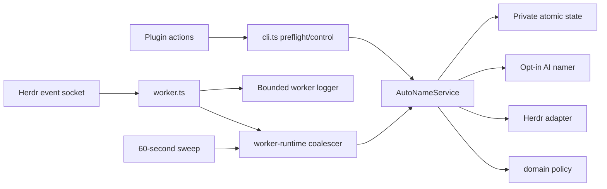
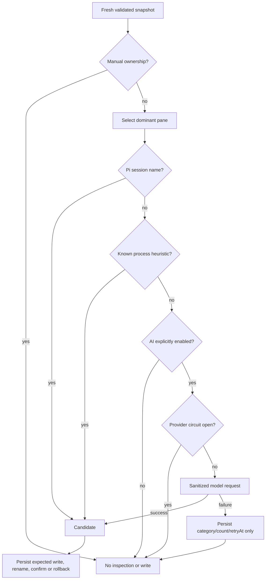

# Architecture

## System overview

Smart Rename is a strict TypeScript Herdr plugin executed by Bun. It runs at most one explicitly enabled worker per Herdr socket. The CLI and worker share `AutoNameService`; the CLI controls manual actions and performs a compatibility preflight, while the worker coalesces lifecycle events and periodic rescans.

Pi session names and deterministic process heuristics are the default. AI is a separately gated provider path and is hard-disabled unless `SMART_RENAME_AI_ENABLED=1|true` is present.

## Components

| Component | Responsibility |
| --- | --- |
| `cli.ts` | Dispatch actions, run snapshot preflight before spawn, serialize starts per socket, wait for child readiness, stop/status, notifications |
| `worker.ts` | Child-side readiness, event subscription, timers, process signals, exact ownership cleanup |
| `worker-runtime.ts` | Bounded sets/maps, single drain, reconnect backoff, idempotent fatal/signal shutdown |
| `worker-log.ts` | Private deduplicated line-bounded logging and one-archive rotation |
| `failure.ts` | Structured Herdr failure classification; protocol mismatch and missing binary are fatal |
| `service.ts` | Ownership reconciliation, context, deterministic naming, AI gate/circuit, expected writes and rollback |
| `domain.ts` | Pure labels, ownership, heuristics, fingerprints, model rate gate and provider cooldown policy |
| `herdr.ts` | Bounded command execution, validated snapshots/processes/events, renames and progress labels |
| `provider.ts` | Explicit enable parsing, private provider config, sanitized provider errors, model output validation |
| `storage.ts` | Per-socket paths, private permissions, atomic state/worker records, locks and stale recovery |
| `pi-context.ts` | Bounded reads from approved Pi session files |
| `text.ts` | ANSI removal, secret redaction, normalization and bounds |

## Worker startup and cardinality

1. `start` derives a state directory from `HERDR_SOCKET_PATH` and holds its start lock.
2. An existing PID is accepted only when both the recorded script and live command match.
3. A read-only `herdr api snapshot` preflight must succeed. Every preflight failure refuses daemonization.
4. The parent spawns with ignored standard streams and keeps the lock through up to five seconds of child readiness polling; lock wait/stale bounds exceed the full preflight-plus-readiness budget.
5. The child repeats snapshot/state initialization, arms lifecycle cleanup, and only then atomically publishes `worker.json`.
6. The parent reports success only after that exact PID/script record is visible.
7. Timeout terminates the child and removes only an exact record it owns.

This makes starts idempotent and keeps the invariant at exactly one ready worker per enabled socket.

## Background flow

Herdr events are normalized at the socket boundary. Rename acknowledgements are stored in a map keyed by item, so only the latest label survives a burst. Direct tab events add a tab ID to a set. Events without a direct tab request one global rescan. The periodic sweep requests the same rescan flag.

One drain applies acknowledgements, snapshots at most once per rescan, and evaluates each dirty tab at most once per pass. Work arriving during a drain requests at most one follow-up pass. A transient command failure retains one pending item/rescan for a delayed retry instead of extending a promise chain.

Socket reconnect uses half-jittered exponential delays from one second to a 60-second cap. `error` only records the bounded error; `close` schedules the single reconnect. The attempt counter resets after a valid event, not a short connect-close cycle.

## Naming and AI circuit

Config/auth/quota failures cool down for six hours; invalid responses for one hour; network/timeout/unknown failures use a five-to-thirty-minute exponential delay. A provider failure is consumed by the service: it never exits the worker and deterministic naming remains available. Success clears the provider circuit.

## Failure and log bounds

- `protocol_mismatch` and missing Herdr binary: take the per-socket start lock, retain ownership until resources quiesce, remove exact ownership before releasing the lock, and guarantee exit code 1 below five seconds. A deadline exit leaves a safe stale record rather than exposing absence while work is active.
- Signals: the same cleanup with exit code 0.
- Identical log messages: one line plus a bounded repeat summary per 60-second window.
- Maximum line length: 800 characters after sanitization.
- Log storage: a symlink-safe 5 MiB active file plus one private mode-`0600` archive, each with a true byte cap.
- Provider state and logs never contain credentials or raw responses; provider secrets are stripped from non-provider subprocess environments.

Smart Rename never restarts or upgrades Herdr. A Herdr server migration is an operational procedure outside the plugin because stopping a server exits pane processes.

## Tradeoffs

- Direct Bun execution avoids a build artifact but requires Bun 1.1.34+.
- The coarse state lock favors correctness over parallel model calls.
- Child-owned readiness adds a short startup wait but removes stale-ready records.
- Fail-closed preflight requires a manual start after temporary startup failure; this is intentional safety behavior.
- Coalescing may delay repeated transient work until its retry timer, but bounds CPU and memory.
- AI quality remains available without making provider health part of worker health.

See `docs/runtime-safety.md` for operational acceptance and rollback.
