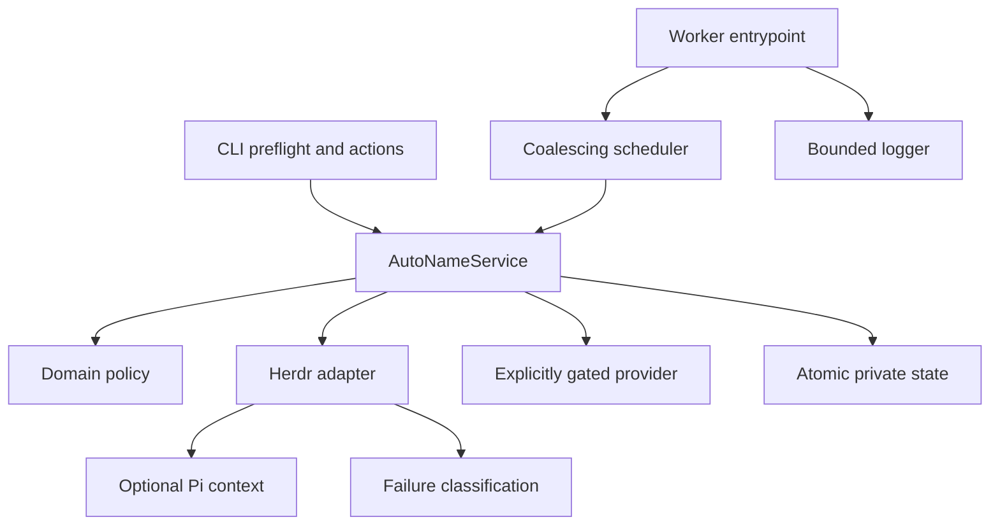

# Semantic map

Smart Rename turns Herdr activity into stable workspace and task-tab labels while keeping manual labels authoritative and runtime failures bounded.

## Domain concepts

| Concept | Meaning | Owner |
| --- | --- | --- |
| Workspace identity | Stable project identity from worktree, existing label, Git root, or pane cwd | `domain.ts` |
| Tab task | A 2–4 word current-task label | `domain.ts` |
| Ownership | Manual versus automatic control of a label | `domain.ts`, `storage.ts` |
| Expected write | Rename intent persisted before Herdr applies it | `domain.ts`, `service.ts` |
| Dominant pane | Focused agent, active agent, focused command, then first pane | `service.ts` |
| Pi session label | Existing bounded Pi conversation name; preferred task source | `pi-context.ts`, `domain.ts`, `service.ts` |
| Deterministic heuristic | Local labels for tests, servers, logs, or remote shells | `domain.ts` |
| AI opt-in | Explicit `SMART_RENAME_AI_ENABLED=1|true`; keys alone never enable calls | `provider.ts`, `run-bun.sh`, `service.ts` |
| Provider circuit | Non-secret category, failure count, and retry timestamp | `domain.ts`, `storage.ts`, `service.ts` |
| Runtime failure | Structured fatal, transient, or generic Herdr command failure | `failure.ts`, `herdr.ts` |
| Worker ownership | Exact PID/script record published only after child readiness | `storage.ts`, `cli.ts`, `worker.ts` |
| Coalesced work | Dirty tab set, one rescan flag, latest acknowledgement map | `worker-runtime.ts` |
| Bounded log | Sanitized/deduplicated active log plus one archive | `worker-log.ts` |

## Technical layers

| Layer | Files | Responsibility |
| --- | --- | --- |
| Entrypoints | `cli.ts`, `configure.ts`, `worker.ts` | Translate actions/events, enforce startup and process lifecycle |
| Runtime control | `worker-runtime.ts`, `worker-log.ts`, `failure.ts`, `subprocess-env.ts` | Coalesce, retry with bounds, fail closed, log with bounds, strip provider secrets from child environments |
| Orchestration | `service.ts` | Reconcile, collect context, choose naming path, apply safe writes |
| Domain | `domain.ts` | Pure ownership, labels, heuristics, fingerprints and cooldowns |
| Herdr integration | `herdr.ts` | Commands, schemas, snapshots, pane evidence, renames, event framing |
| Provider | `provider.ts` | Opt-in flag, config, sanitized failure category, model output validation |
| Persistence | `storage.ts` | Per-socket state, locks, atomic files, exact worker identity |
| Context/text | `pi-context.ts`, `text.ts` | Approved bounded session reads and secret-safe text |

## Runtime paths

### Start

1. Acquire the start lock for the hashed Herdr socket state directory.
2. Return the existing exact worker if present.
3. Require a successful read-only snapshot preflight.
4. Spawn without inherited log file descriptors.
5. Child initializes snapshot/state, arms lifecycle cleanup, and atomically publishes readiness ownership.
6. Parent confirms the exact child PID before success; live different-script or unverifiable records are non-destructive conflicts.

### Background event

1. Parse and validate the LF-delimited Herdr event.
2. Keep only the latest rename acknowledgement per item.
3. Add a direct tab ID to the dirty set or set the single rescan flag.
4. One drain handles the bounded pending state.
5. Fatal Herdr failures invoke one shutdown; transient failures preserve one retry request.

### Evaluation

1. Reconcile a fresh validated snapshot under the state lock.
2. Stop early for manual ownership.
3. Prefer Pi session label, then local heuristic.
4. If ambiguous, require explicit AI enablement and a closed provider circuit.
5. On provider failure, persist only cooldown metadata and return no model candidate.
6. Before a rename, persist the expected label; confirm from the event or roll back on command failure.

### Shutdown

- Signal: hold the per-socket start lock, retain ownership while resources quiesce, remove exact ownership, release the lock, and guarantee exit 0 before the hard deadline.
- Protocol mismatch or missing binary: the same ordered ownership protocol and guaranteed exit 1; a deadline exit intentionally leaves stale ownership rather than a missing live-worker record.
- No path restarts a Herdr server.

## Data boundaries

| Boundary | Validation/bound | Durable output |
| --- | --- | --- |
| Herdr command | streaming stdout/stderr caps, secret-stripped environment, structured code precedence | typed result or metadata-bearing `HerdrRuntimeError` |
| Snapshot/process/event | JSON plus Zod schemas | trusted Herdr structures |
| Event queue | sets, one flag, latest-value map | bounded in-memory pending work |
| Pi session | approved root/regular file and bounded sampling | sanitized timeline |
| Provider config | 16 KiB dotenv plus Zod | in-memory config only |
| Model context | sanitization and 4,500-char cap | request payload only when opted in |
| Provider failure | category classification and sanitized detail | category/count/retryAt only |
| State | Zod, cross-process lock, atomic rename | private version-1 JSON |
| Worker identity | exact PID/script, atomic rename | private `worker.json` after readiness |
| Worker log | 800-char lines, dedupe, symlink rejection, true 5 MiB byte cap | mode-`0600` active + one archive |

## Invariants

- Manual labels win until explicitly reclaimed.
- AI is never inferred from a key or provider file alone.
- Provider failure never becomes worker failure.
- Protocol mismatch and missing Herdr binary never retry indefinitely.
- Worker count is zero when disabled and exactly one per enabled socket.
- A burst cannot grow pending work proportionally.
- Logs and state contain no secrets or raw provider responses.
- Rollback stops or leaves off the worker; it never restarts Herdr.
